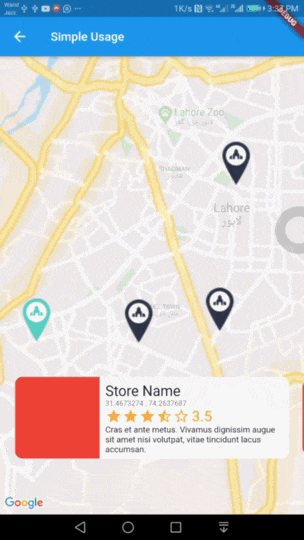

# interactive_maps_marker for Flutter
Easy to use Animated Maps Markers with detail card. Use it for store or any place locator.
## Demo


## Usage
Add this package to your `pubspec.yaml` in `dependencies:` section
```yaml
dependencies: 
  interactive_maps_marker: ^0.0.2
```
This package depends upon ```google_maps_flutter``` so first setup this by following [This Guide](https://pub.dev/packages/google_maps_flutter)

Update dependencies 
```
flutter pub get
```
You can now add a ``` InteractiveMapsMarker ``` widget to your widget tree.


### Simple Usage
In your widget import the package and use ```InteractiveMapsMarker``` Widget

**Example**
```dart
import 'package:flutter/material.dart';
import 'package:google_maps_flutter/google_maps_flutter.dart';
import 'package:interactive_maps_marker/interactive_maps_marker.dart';

class ExplorePage extends StatelessWidget {
  @override
  Widget build(BuildContext context) {

    return InteractiveMapsMarker(
      items: <MarkerItem>[
        MarkerItem(id: 1, latitude: 31.4673274, longitude: 74.2637687),
        MarkerItem(id: 2, latitude: 31.4718461, longitude: 74.3531591),
      ],
      center: LatLng(31.4906504, 74.319872),
      itemContent: (context, index) {
        return Text("Current Item $index");
      },
    );

  }
}
```

### Advanced Usage
Coming Soon

### Markers data from a remote server?
Use this widget inside a stateful widget and update the markers list state with new data. An example can be found in ```stateful_example.dart``` file in example project.


